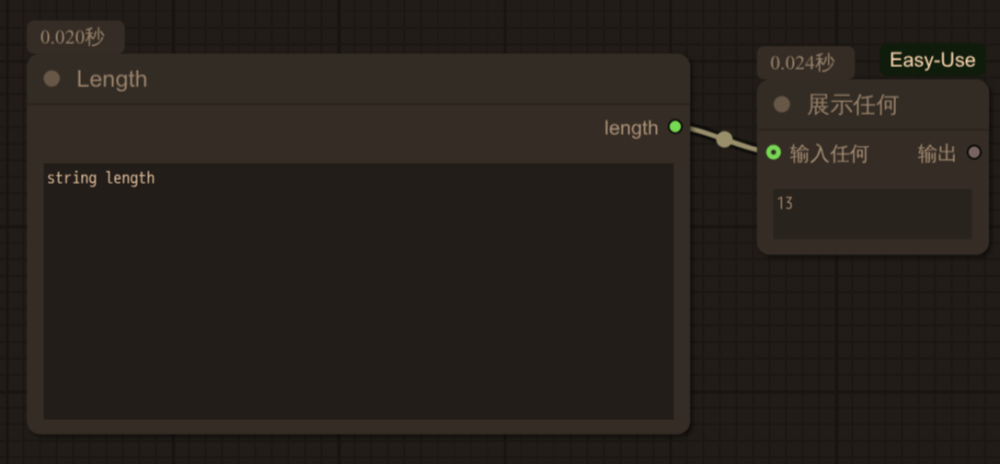

# n8n-nodes-comfyui-any

This package provides n8n nodes to integrate with [ComfyUI](https://github.com/comfyanonymous/ComfyUI) - Support any workflow output.

## Background

In n8n, if I want to obtain the images generated by comfyui, I can use it [n8n-nodes-comfyui](https://github.com/mason276752/n8n-nodes-comfyui)。If I want to obtain the videos generated by comfyui, I can use it [n8n-nodes-comfyui-image-to-video](https://github.com/ChristianKuri/n8n-nodes-comfyui-image-to-video)。But if I want to obtain the output of a custom node in comfyui, what should I do? Then you can give it a try [n8n-nodes-comfyui-any](https://github.com/zerorooot/n8n-nodes-comfyui-any)

### Example

Suppose our custom node of comfyui is as follows:
<details>
<summary>comfyui <b>workflow</b> and sample images</summary>
{"id":"bdd2c995-cc7a-416b-b119-3793579a40b2","revision":0,"last_node_id":14,"last_link_id":11,"nodes":[{"id":13,"type":"StringLength","pos":[1412.6959228515625,726.2750244140625],"size":[400,200],"flags":{},"order":0,"mode":0,"inputs":[{"localized_name":"string","name":"string","type":"STRING","widget":{"name":"string"},"link":null}],"outputs":[{"localized_name":"length","name":"length","type":"INT","links":[11]}],"properties":{"cnr_id":"comfy-core","ver":"0.3.52","Node name for S&R":"StringLength"},"widgets_values":["string length"]},{"id":14,"type":"easy showAnything","pos":[1890.91845703125,766.418212890625],"size":[140,76],"flags":{},"order":1,"mode":0,"inputs":[{"localized_name":"输入任何","name":"anything","shape":7,"type":"*","link":11}],"outputs":[{"localized_name":"输出","name":"output","type":"*","links":null}],"properties":{"cnr_id":"comfyui-easy-use","ver":"93254a4c073431ad45be5bef0e66bd38f40a2583","Node name for S&R":"easy showAnything"},"widgets_values":["13"]}],"links":[[11,13,0,14,0,"*"]],"groups":[],"config":{},"extra":{"ds":{"scale":0.8954302432552947,"offset":[-819.6894744665262,-274.54124324273243]}},"version":0.4}
</details>


The final result will be returned

```json
[{"14":{"text":["13"]}}]
```

In this way, you will get the result you want.


## Features

- Execute ComfyUI workflows directly from n8n
- Support for workflow JSON import
- Support any workflow output
- Progress monitoring and error handling
- Support for API key authentication
- Configurable timeout settings

## Node Configuration

## Installation

```bash
npm install n8n-nodes-comfyui-any
```

### ComfyUI Node

This node allows you to execute ComfyUI workflows and Support any workflow output

#### Settings

- **API URL**: The URL of your ComfyUI instance (default: http://127.0.0.1:8188)
- **API Key**: Optional API key if authentication is enabled
- **Workflow JSON**: The ComfyUI workflow in JSON format

#### Outputs
```json
promptResult.outputs
```
## Usage Example

1. Export your workflow from ComfyUI as JSON
2. Create a new workflow in n8n
3. Add the ComfyUI node
4. Paste your workflow JSON
5. Configure the API URL

## Error Handling

The node includes comprehensive error handling for:
- API connection issues
- Invalid workflow JSON
- Execution failures
- Timeout conditions (default 30 minutes)


## License

[MIT](LICENSE.md)

